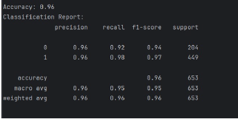
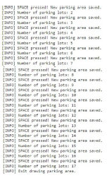

# 🅿️ Parking Slots Detection – Machine Learning & Computer Vision

An intelligent parking management solution that detects the occupancy status of parking slots from CCTV images and predicts availability patterns using **Machine Learning (SVM, Random Forest, KNN)** and **Computer Vision (OpenCV)** techniques.

---

## 🚀 Features

- **Vacancy Detection:**
  - **SVM + HOG Features** — Classifies individual parking spots as vacant/occupied with **96% accuracy**.
  - **Computer Vision (OpenCV)** — Real-time detection and counting of occupied/vacant slots using background subtraction & bounding boxes.
- **Time & Date-Based Prediction:** Predicts availability patterns based on historical occupancy trends using **Decision Tree**, **Random Forest**, **KNN**, and more.
- **Annotation Workflow:** Manual parking slot labeling for dataset preparation.
- **Performance Metrics:** Accuracy, precision, recall, and F1-score tracking for each model.

---

## 🛠 Tech Stack

**Core ML & CV**
- Python, Scikit-Learn, OpenCV, NumPy, Pandas, Matplotlib

**Models Implemented**
- SVM (Support Vector Machine)
- Random Forest, Decision Tree, KNN, Logistic Regression, Naïve Bayes, Neural Network

**Data**
- [Find a Car Park – Kaggle Dataset](https://www.kaggle.com/datasets/daggysheep/find-a-car-park/data)

---

## 📂 Repository Structure

```plaintext
├── images/                          # Screenshots for README
├── sample data/                     # Sample dataset images
├── Urban_computing_final_project.pdf # Project report
├── image_date_extractor.py           # Extracts date/time metadata from images
├── SVM_Model_Computer_vision.py      # SVM + HOG classifier training/testing
├── Based_on_date_time_vacancy_predictor.py # Time & date-based vacancy prediction models
├── date_time_dataset.csv             # Metadata for time/date prediction
├── requirements.txt                  # Dependencies
├── README.md                         # Project documentation
```
## 🖥 Running Locally

**1️⃣ Install dependencies**
```bash
pip install -r requirements.txt
```
**2️⃣ Run SVM-based Vacancy Detection**
```bash
python "SVM Model Computer vision.py"
```
**3️⃣ Run Computer Vision (OpenCV) Real-date & time Detection**
```bash
python image_date_extractor.py
```
**4️⃣ Run Free Prediction Models based on Time & Date**
```bash
python "Based on date_time vacancy predictor.py"
```

## ⚙ Configuration
- **Dataset:** Place `free/` and `full/` folders inside the `sample_data/` directory.
- **Parameters:** Modify image dimensions, HOG parameters, and model settings inside respective `.py` scripts.

---

## 📈 Results

- **SVM + HOG:** 96% accuracy, high precision & recall.
- **Real-time CV:** Successfully detects and counts slots in under 0.05s per frame on CPU.

### Time & Date-Based Prediction (7 Models)

| Model                  | Accuracy | Precision (avg) | Recall (avg) | F1-score (avg) |
|------------------------|----------|-----------------|--------------|----------------|
| Decision Tree          | 0.92     | 0.92             | 0.92         | 0.92           |
| Neural Network         | 0.69     | 0.48             | 0.69         | 0.49           |
| K-Nearest Neighbors    | 0.92     | 0.92             | 0.92         | 0.92           |
| Random Forest          | 0.92     | 0.92             | 0.92         | 0.92           |
| Support Vector Machine | 0.70     | 0.49             | 0.70         | 0.49           |
| Logistic Regression    | 0.70     | 0.49             | 0.70         | 0.49           |
| Naïve Bayes            | 0.68     | 0.48             | 0.68         | 0.48           |

---

## 📸 Screenshots
### SVM + HOG Detection Output


### Computer Vision (OpenCV) Real-time Detection


### Decision Tree Plot

